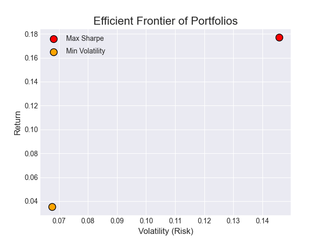
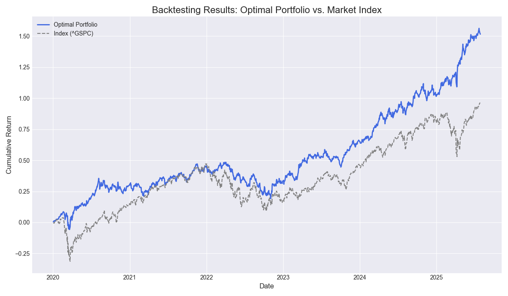
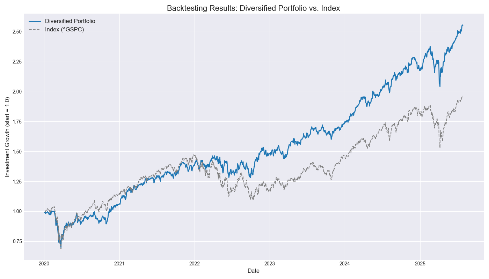
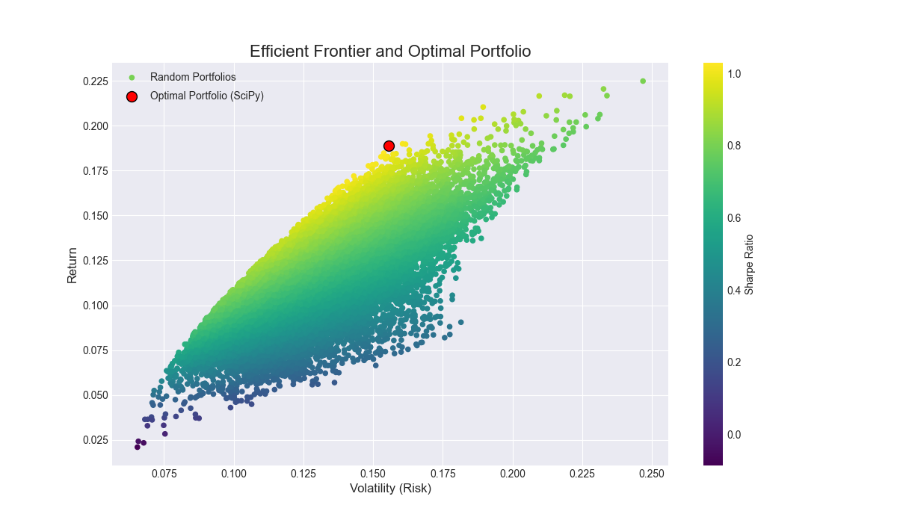

# Portfolio Optimization & Backtesting Engine 📈

This project is a Python-based tool for modern portfolio theory analysis. It fetches historical stock data, performs mathematical optimization using **SciPy** to find the optimal portfolio allocation based on the Sharpe ratio, and backtests the portfolio's performance against a market benchmark (S&P 500).

## ✨ Key Features

-   **Data Fetching:** Downloads daily price data for stocks, ETFs, and benchmarks using the `yfinance` API.
-   **Risk-Free Rate Integration:** Incorporates real-world risk-free rate data (US Treasury Bill yields) for accurate Sharpe Ratio calculation.
-   **Mathematical Optimization:** Utilizes the `SciPy` library to find the true optimal portfolio weights, moving beyond simple Monte Carlo simulation.
-   **Backtesting:** Compares the historical performance of the optimized portfolio against a benchmark index.
-   **Visualization:** Generates clear plots for the efficient frontier and backtesting results using `Matplotlib`.

## 🛠️ Tech Stack

-   **Python**
-   **Libraries:** Pandas, NumPy, Matplotlib, yfinance, SciPy
-   **Environment:** Jupyter Notebook

## 📊 Results

### Efficient Frontier
The scatter plot below shows randomly generated portfolios (the "cloud") and marks the mathematically optimal portfolio found by SciPy (the red dot).



### Backtesting Performance
This chart compares the cumulative return of the optimal portfolio against the S&P 500 index over the selected period.





## 🚀 How to Run

1.  **Clone the repository:**
    ```bash
    git clone [https://github.com/lxnk4v/Portfolio-Optimization-Engine.git](https://github.com/ВАШ_НИКНЕЙМ/Portfolio-Optimization-Engine.git)
    ```
2.  **Navigate to the project directory:**
    ```bash
    cd Portfolio-Optimization-Engine
    ```
3.  **Create and activate a virtual environment:**
    ```bash
    python -m venv venv
    source venv/bin/activate  # On Windows, use `venv\Scripts\activate`
    ```
4.  **Install the required dependencies:**
    ```bash
    pip install -r requirements.txt
    ```
5.  **Run the Jupyter Notebook:**
    ```bash
    jupyter lab Portfolio_Optimization_Analysis.ipynb
    ```
